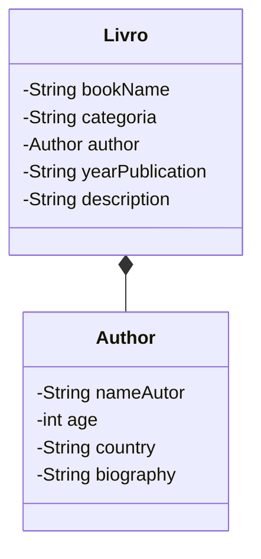

# First Own APi - 2024

## Diagrama de classes



#Exemplo de Json para usar no Swagger UI.

```json
{
  "bookName": "Joao",
  "categoria": "Ação",
  "author": {
    "nameAutor": "Joao",
    "age": 22,
    "country": "Brazil",
    "biography": "Um bom autor"
  },
  "yearPublication": "1999",
  "description": "Um livro de ação"
}

